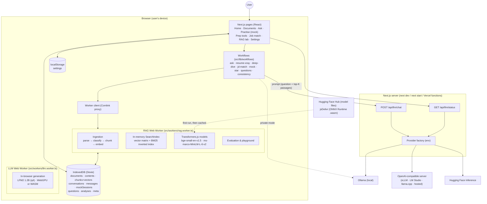
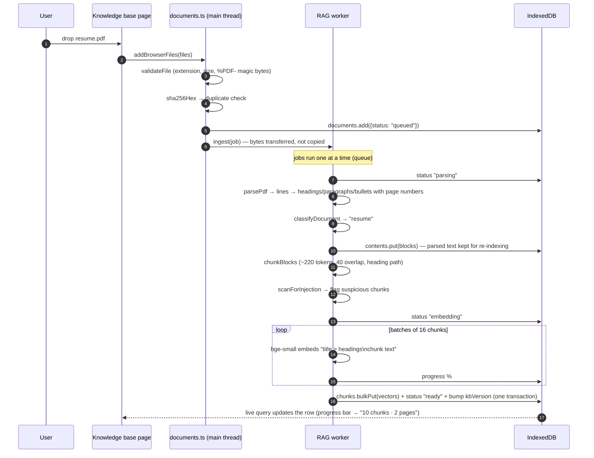
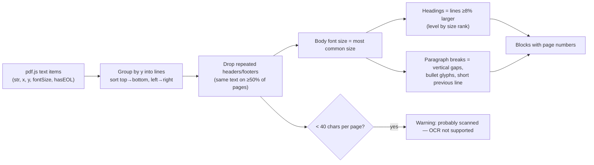
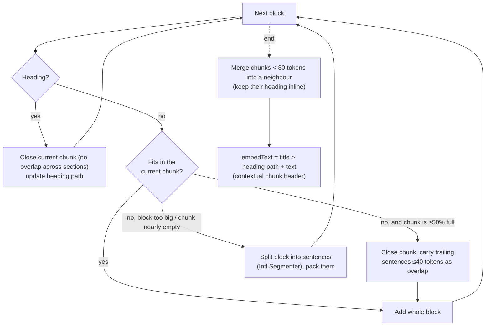
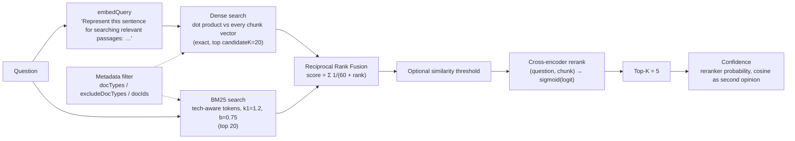
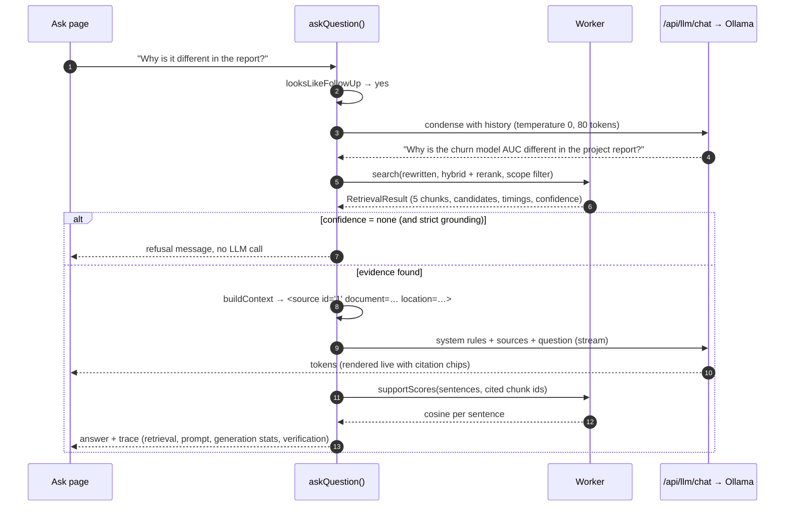
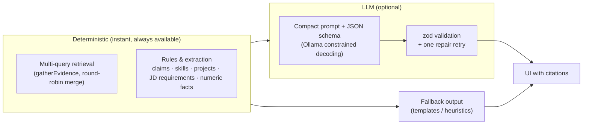
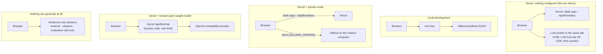
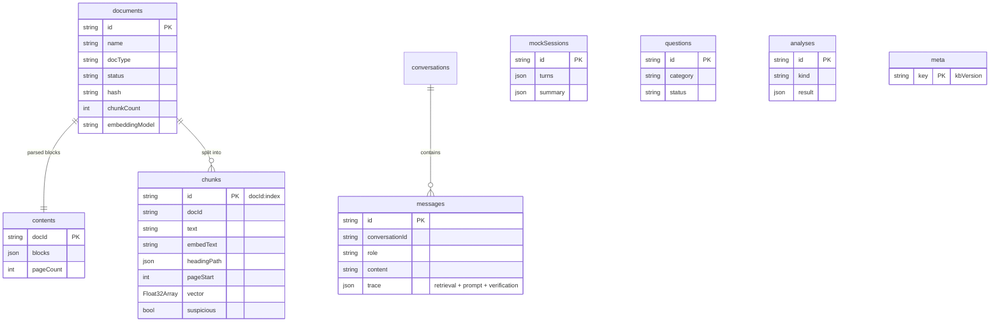

# Architecture

This document shows how ResumeRAG fits together, from the deployment level down to each pipeline. For _why_ each choice was made, see [DESIGN_DECISIONS.md](DESIGN_DECISIONS.md). For where the code lives, see [CODEBASE_GUIDE.md](CODEBASE_GUIDE.md).

## 1. System overview

**Division of responsibilities**

| Where                  | What                                                               | Why there                                                          |
| ---------------------- | ------------------------------------------------------------------ | ------------------------------------------------------------------ |
| Web Worker             | Parsing, chunking, embeddings, search, reranking, evaluation       | CPU-heavy; keeps the UI thread free; data is already on the device |
| Main thread            | UI, workflow orchestration, prompt construction, streaming display | Needs React state and user interaction                             |
| IndexedDB              | All persistent data                                                | Free, private, survives reloads                                    |
| Next.js route handlers | LLM proxy and status                                               | Holds provider credentials; enforces limits                        |
| LLM provider           | Text generation                                                    | Needs GB of RAM / a GPU — not available in serverless functions    |

## 2. Ingestion pipeline

**Parsing detail (PDF).** PDFs store positioned text fragments, not paragraphs:

## 3. Chunking

## 4. Retrieval

Every candidate keeps `denseScore/denseRank`, `keywordScore/keywordRank`, `fusedScore/fusedRank`, `rerankScore/rerankRank`, `finalRank` and a `dropReason`, which is what the "How this answer was generated" panel displays.

## 5. Generation (Ask)

**Which model answers.** `streamChat` resolves the connection first (`src/lib/llm/client.ts`): the default "automatic" mode uses the server's provider when `/api/llm/status` reports a reachable one, and otherwise the in-browser model in the LLM worker — so a deployment with no model still generates. If nothing can run, `askQuestion` returns an **evidence-only** answer: the most relevant sentences from the top passages, each with its citation, clearly labelled as quotes.

## 6. Interview workflows

Every workflow follows _deterministic first, LLM second_:

| Workflow            | Deterministic part                                                                                                                             | LLM part                                           |
| ------------------- | ---------------------------------------------------------------------------------------------------------------------------------------------- | -------------------------------------------------- |
| Resume X-ray        | claim extraction, weakness rules, cross-document conflicts, skills map, "what supports this?" retrieval                                        | likely / grill questions                           |
| Project deep dive   | project detection, 5-query evidence, preparation checklist                                                                                     | 5 explanation levels (streamed), question ladder   |
| JD match            | requirement extraction, one retrieval per requirement (candidate docs only), status from reranker scores + skill mentions + absence statements | summary, prep plan, likely questions               |
| Mock interview      | evidence retrieval, delivery stats, adaptive difficulty, unsupported-claim check (each answer sentence verified against your documents)        | question, rubric evaluation, better-answer outline |
| STAR builder        | evidence retrieval, "no evidence" guard                                                                                                        | STAR structure with facts vs phrasing              |
| Consistency checker | numeric fact extraction and pairing                                                                                                            | verdict per pair                                   |
| Question generator  | category-specific retrieval                                                                                                                    | tailored questions (templates without LLM)         |

## 7. Deployment modes

## 8. Data model (IndexedDB)

`meta.kbVersion` is bumped by every change to documents or chunks; the worker compares it with the version its in-memory index was built from and rebuilds when they differ.
