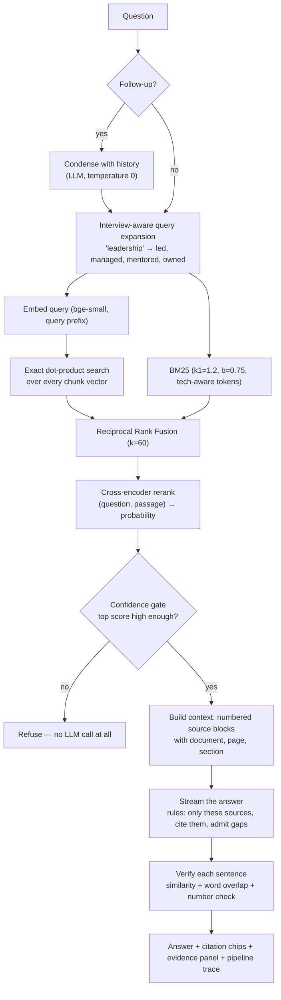
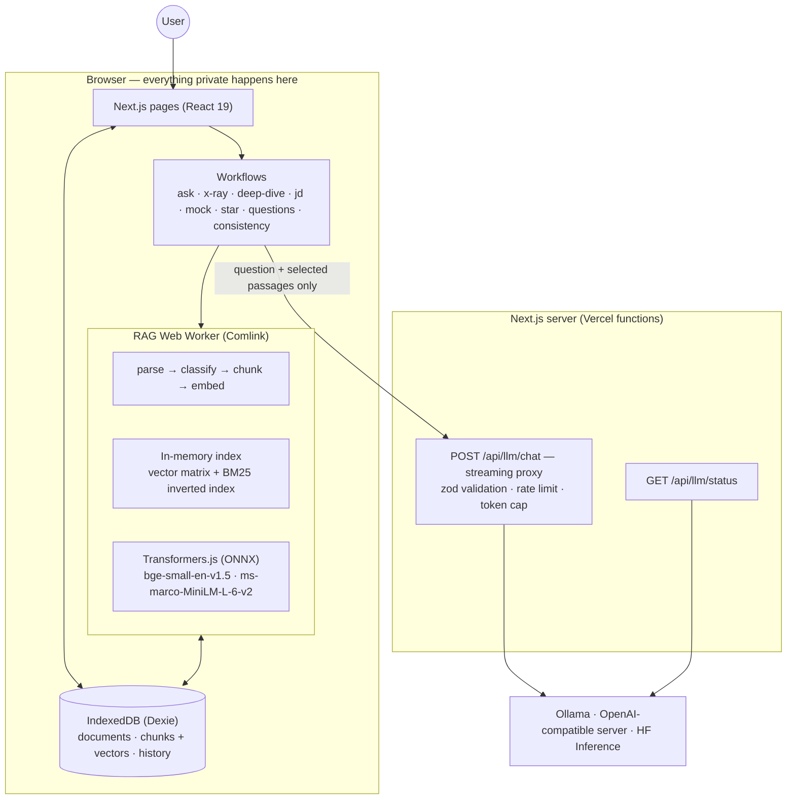

# ResumeRAG — project overview

_One document that explains what this project is, how it works, how it is put together, and why it is built this way._

If you only read one file in this repository, read this one. Deeper material lives in
[ARCHITECTURE.md](ARCHITECTURE.md) (diagrams), [DESIGN_DECISIONS.md](DESIGN_DECISIONS.md) (28 decisions in detail),
[CODEBASE_GUIDE.md](CODEBASE_GUIDE.md) (file-by-file tour), [PROJECT_EXPLAINED_SIMPLY.md](PROJECT_EXPLAINED_SIMPLY.md)
(every term explained from zero) and [LIMITATIONS_AND_ROADMAP.md](LIMITATIONS_AND_ROADMAP.md) (what it does not do).

---

## 1. What it is

**ResumeRAG is an interview preparation tool built on retrieval-augmented generation over your own documents.**

You upload the things that describe your work — resume, project reports, papers, internship documents, notes, a job
description, a company page. The app parses them, splits them into passages, embeds them, and builds a searchable
knowledge base **inside your browser**. Then it helps you prepare:

- it answers questions about your own history with **citations to the exact page and section**;
- it **refuses** when your documents do not contain the answer, instead of inventing one;
- it interrogates your resume the way an interviewer would, finds contradictions between documents, matches you against
  a job description without inventing skills, and runs adaptive mock interviews that grade you against your evidence.

The thing that makes it more than a chatbot wrapper is the constraint it enforces on itself: **every claim must be
traceable to a passage you uploaded.** A "How this answer was generated" panel shows the retrieval scores, the prompt
that was built, and a per-sentence verification of the answer against the cited sources.

**Constraints it was built under (all deliberate):**

| Constraint                        | Consequence                                                                                                                                                                     |
| --------------------------------- | ------------------------------------------------------------------------------------------------------------------------------------------------------------------------------- |
| No paid APIs anywhere in the core | Embeddings, reranking, search, evaluation **and generation** all run on the user device by default; Ollama or any OpenAI-compatible server can be plugged in for better answers |
| Deployable on Vercel              | The app is static + two small route handlers; the heavy compute is in the browser, and the deployment modes are documented honestly rather than hidden                          |
| Privacy claims must be true       | Documents and vectors never leave the device; only the question plus the selected passages go to the language model — and the UI says exactly that                              |
| An understandable core            | The whole RAG pipeline is plain TypeScript in `src/lib/rag`, with no framework abstraction between you and the algorithm                                                        |

---

## 2. What you can do with it

The app has **two primary features** — Ask and Practise — and the rest are tools you reach for when you
need them. Home lays that out as three steps (add documents → ask → practise); the sidebar keeps the two
primary features at the top, groups the specialised tools under "More tools", and hides the engineering
views behind "Under the hood". Long work always shows itself: a progress bar under the header while a model
downloads or documents index, and skeletons instead of blank pages.

| Feature                 | What it does                                                                                                                                                                | Grounding rule                                                                                 |
| ----------------------- | --------------------------------------------------------------------------------------------------------------------------------------------------------------------------- | ---------------------------------------------------------------------------------------------- |
| **Ask**                 | Conversational Q&A over your documents, with follow-up handling and scope filters ("only my resume", "only projects")                                                       | Refuses below the confidence gate; every sentence verified against its citation                |
| **Resume X-ray**        | Extracts every claim from your resume and flags the risky ones: unquantified impact, buzzwords, unclear ownership, weak skill claims, big numbers, cross-document conflicts | Rules are deterministic and explainable; "what supports this?" runs a retrieval per claim      |
| **Project deep dive**   | Explains any detected project at five levels (one line → recruiter → engineer → deep → architecture), plus a ladder of progressively harder follow-ups                      | Explanations are generated only from retrieved passages of that project's documents            |
| **Job match**           | Extracts requirements from a job description and scores each one: strong / partial / gap — with the evidence quoted                                                         | Never credits a skill that is not in your documents; "gap" is a real answer                    |
| **Mock interview**      | Adaptive interview: harder follow-ups when you answer well, easier when you struggle; rubric scoring; a better-answer outline                                               | Your answer is checked sentence-by-sentence against your own documents, so bluffing is flagged |
| **"Grill my resume"**   | Generates the hostile questions an interviewer would actually ask about each bullet                                                                                         | Each question points at the bullet and passage that provoked it                                |
| **STAR builder**        | Turns evidence into a Situation-Task-Action-Result story, separating **facts from your documents** from **suggested phrasing**                                              | Refuses to build a story with no evidence behind it                                            |
| **Question generator**  | Tailored questions by category and difficulty, saved into a tracked question bank                                                                                           | Every question cites the passage that prompted it                                              |
| **Consistency checker** | Finds numeric and factual disagreements between documents ("AUC 0.91" on the resume vs "0.89" in the report)                                                                | Pairs are found deterministically; the LLM only judges the pair                                |
| **RAG playground**      | Change one retrieval knob at a time (mode, top-K, candidates, rerank, chunk size) and watch the evidence change; compare modes side by side                                 | Builds a temporary index — your real knowledge base is untouched                               |
| **Evaluation**          | Runs a labelled 30-question benchmark across four retrieval strategies in your browser, plus a generation check against your local model                                    | The numbers in this document come from exactly this harness                                    |

---

## 3. How it works — the life of one question

Take _"What machine learning project did I build during my internship?"_ against a resume that says
_"Built a customer churn prediction system using XGBoost that achieved an AUC of 0.91 on the holdout set."_



**Step by step:**

1. **Follow-up detection.** If the question depends on history ("why is it different in the report?"), it is condensed
   into a standalone question first — otherwise retrieval searches for the pronoun instead of the topic.
2. **Query expansion.** Interview questions are abstract; documents are concrete. A hand-written vocabulary maps
   interview themes to the words people actually write ("leadership" → _led, managed, mentored, owned, team of_). This
   goes to BM25 **and** to the reranker.
3. **Two searches in parallel.** Dense: the query is embedded (with bge's required query prefix) and compared by dot
   product against every chunk vector — exact, not approximate. Keyword: BM25 over a tokenizer that keeps `c++`,
   `scikit-learn` and `f1` intact.
4. **Fusion.** Reciprocal Rank Fusion combines the two ranked lists using ranks only (`1/(60+rank)`), because BM25
   scores and cosine similarities are not on comparable scales.
5. **Reranking.** A cross-encoder reads the question _and_ each candidate together and outputs a relevance probability.
   This is both the best ranker and the best "is this answerable at all?" signal in the whole pipeline.
6. **Confidence gate.** Below the threshold the app refuses and never calls the language model — the cheapest
   hallucination is the one that is never generated. A cosine-similarity "second opinion" rescues cases the reranker
   misjudges.
7. **Context building.** The top 5 passages become numbered `<source>` blocks carrying document name, page and section,
   with the content escaped and explicitly marked untrusted.
8. **Generation.** The prompt's rules are short and strict: use only the sources, cite them as `[1]`, say when something
   is missing, never invent. The answer streams token by token.
9. **Verification.** Each generated sentence is embedded and compared against the sentences of its cited passages; a
   sentence is "verified" only if it is close enough, shares enough content words, and states no number that is absent
   from the source. Unverified sentences are marked in the UI, with the reason.
10. **The trace.** Everything above — the expansion, per-candidate scores at each stage, why a candidate was dropped,
    the prompt size, tokens per second, the verification verdicts — is shown in the "How this answer was generated"
    panel and stored with the message.

---

## 4. Architecture



**Where each responsibility lives, and why**

| Layer          | Contents                                                                                          | Why there                                                                     |
| -------------- | ------------------------------------------------------------------------------------------------- | ----------------------------------------------------------------------------- |
| Web Worker     | Parsing, chunking, embedding, search, reranking, evaluation                                       | CPU-heavy work that must not freeze the UI; the data is already on the device |
| Main thread    | UI, workflow orchestration, prompt construction, streaming                                        | Needs React state and user interaction                                        |
| IndexedDB      | Documents, parsed blocks, chunks + `Float32Array` vectors, conversations, mock sessions, analyses | Free, private, survives reloads; vectors stay binary                          |
| Route handlers | The LLM proxy and status endpoint                                                                 | Keeps provider credentials server-side and enforces limits                    |
| LLM provider   | Text generation only                                                                              | Needs GB of RAM or a GPU, which serverless functions do not have              |

**Deployment modes (documented, not hidden):**

1. **Vercel with nothing configured (what the live demo runs)** — the whole app, generation included, runs in the
   visitor's tab: a small open-weight model (LFM2 1.2B, ~850 MB downloaded once and cached, WebGPU or CPU) writes the
   cited answers. No key, no account, nothing sent anywhere.
2. **Local** — `next dev` plus Ollama on your machine: the best quality, and what development uses.
3. **Vercel + private mode** — the deployed app talks to the _visitor's own_ Ollama; nothing but the page comes from the server.
4. **Vercel + hosted open-weight model** — the proxy points at any OpenAI-compatible endpoint, protected by an access code, a model allowlist and a rate limit.

If no model can run at all, the app answers in **evidence-only mode** by quoting the most relevant sentences: RAG minus
the "G" still works.

**Ingestion pipeline:** validate (extension, size, magic bytes) → SHA-256 duplicate check → parse (unpdf with layout
reconstruction for PDFs, mammoth for DOCX, custom parsers for MD/TXT) → classify document type → structure-aware
chunking → prompt-injection scan → embed in batches of 16 with live progress → store chunks and bump `kbVersion` in one
transaction. Failures are per-document and retryable; re-indexing reuses the stored parsed blocks instead of re-parsing.

---

## 5. The decisions that matter

The full list is in [DESIGN_DECISIONS.md](DESIGN_DECISIONS.md); these are the ones worth defending out loud.

| #   | Decision                                                               | Alternative rejected                                    | Why, and the evidence                                                                                                                                                                                                                                                     |
| --- | ---------------------------------------------------------------------- | ------------------------------------------------------- | ------------------------------------------------------------------------------------------------------------------------------------------------------------------------------------------------------------------------------------------------------------------------- |
| 1   | **Run the whole pipeline — retrieval and generation — in the browser** | A server-side Python/LangChain service                  | The privacy claim becomes structural, not a promise; hosting is free; it forces an honest architecture. Cost: a first-run model download and CPU-bound ingestion                                                                                                          |
| 2   | **bge-small-en-v1.5 (384-d, q8, ~34 MB)**                              | MiniLM-L6 (weaker), bge-base (4× bigger), OpenAI (paid) | Best retrieval quality per megabyte for a first-visit download; 384 dimensions keep IndexedDB small. Swappable in Settings, with per-model confidence calibration                                                                                                         |
| 3   | **Structure-aware chunking, 220 tokens, 40 overlap**                   | Fixed-size character windows                            | Chunks never cross a heading, so a citation is always "one section of one document". Measured sweep: 120 tokens lost context (96.2% recall, 0.856 MRR), 220 reached 100% / 0.894, and 350–500 gained nothing while making citations vaguer                                |
| 4   | **Hybrid retrieval with Reciprocal Rank Fusion (k=60)**                | Pure vector search                                      | Vector search alone misses exact tokens (`XGBoost`, `FAISS`, `p95`); BM25 alone misses paraphrase. RRF needs no score normalisation. Recall@5 78.8% → 88.5%, MRR 0.710 → 0.804                                                                                            |
| 5   | **Cross-encoder reranking (ms-marco-MiniLM-L-6-v2)**                   | Trusting the fused ranks; an LLM reranker               | +11.5 points Recall@5 (→ 100%) and +0.09 MRR for ~370 ms per query in Node (1.1–1.5 s in the browser, after COOP/COEP unlocked multi-threaded WebAssembly). Also the single best answerability signal: unanswerable questions score ≈ 0.000                               |
| 6   | **Refuse instead of guessing**                                         | Always answer with the best available context           | The product is only useful if you can trust it the day before an interview. 100% of the deliberately unanswerable questions are refused, versus 75% when gating on cosine similarity                                                                                      |
| 7   | **Interview-aware query expansion**                                    | Nothing; or an LLM rewrite on every query               | Added _because the evaluation exposed failures_ on behavioural questions. Deterministic, instant, inspectable. Expanding for BM25 alone did not help — the reranker undid the gain — so the reranker sees it too: recall 94.2% → 100%, answer/refuse accuracy 90% → 96.7% |
| 8   | **Deterministic first, LLM second**                                    | Let the model do everything                             | Every workflow produces a useful result with no model running: claim extraction, conflict detection, JD scoring, project detection and evidence retrieval are rules plus retrieval. The LLM only phrases and judges — so the app degrades instead of breaking             |
| 9   | **Exact brute-force vector search**                                    | HNSW / a vector database                                | At personal scale (hundreds to thousands of chunks) exact search takes ~9 ms, gives perfect recall and needs no index maintenance. The `SearchIndex` interface is written so a pgvector implementation could drop in                                                      |
| 10  | **Constrained JSON decoding + zod + one repair retry**                 | Asking politely for JSON and hoping                     | Small local models produce broken JSON often enough to matter. Ollama's JSON-schema `format` mode plus schema validation makes the structured workflows reliable                                                                                                          |
| 11  | **Citation verification as an explicit, imperfect proxy**              | Claiming "verified" from similarity alone               | Similarity is not entailment, so verification also requires matching numbers and enough word overlap, and the UI says _why_ a sentence is unverified. Calibrated against 15 hand-labelled pairs (14 correct)                                                              |
| 12  | **Evaluate everything and publish the failures**                       | A polished demo video                                   | A retrieval benchmark, a chunk-size sweep, per-question results and a generation check ship _inside the app_ — including the question it still gets wrong                                                                                                                 |

---

## 6. Does it actually work? — the evaluation

30 labelled questions over the six fictional demo documents (42 chunks). 26 are answerable and labelled with the facts
their answer requires; 4 are deliberately unanswerable ("Have I ever worked at Google?"), where the correct behaviour is
a refusal. Run it with `npm run eval`, or in the browser on the Evaluation page. Latencies below are retrieval only, measured in
Node on a laptop CPU; in the browser reranking costs 1.1–1.5 s.

| Configuration                     | Hit@5    | Recall@5 | MRR       | nDCG@5    | Unanswerable refused | Mean latency |
| --------------------------------- | -------- | -------- | --------- | --------- | -------------------- | ------------ |
| BM25 only                         | 96.2%    | 90.4%    | 0.783     | 0.797     | 0%                   | <1 ms        |
| Semantic only                     | 88.5%    | 78.8%    | 0.710     | 0.702     | 75%                  | 9 ms         |
| Hybrid (RRF)                      | 92.3%    | 88.5%    | 0.804     | 0.799     | 75%                  | 9 ms         |
| **Hybrid + cross-encoder rerank** | **100%** | **100%** | **0.894** | **0.921** | **100%**             | 373 ms       |

**What these numbers mean.** Recall@5 is the share of _facts needed to answer_ that appear in the five passages sent to
the model — the ceiling on answer quality. MRR rewards putting the right passage first. The refusal column is the one
most RAG demos never show: BM25 alone happily answers questions about jobs you never had.

**Reading the table honestly:**

- Every stage earns its cost. Fusion beats either retriever alone on recall and MRR; reranking adds the last points of
  recall and turns refusal from a coin flip into reliable behaviour.
- BM25's high score here is partly a property of the test set — the questions share vocabulary with the documents —
  which is exactly why the keyword stage was kept rather than replaced by embeddings.
- **What still fails:** one answerable question, _"What leadership experience do I have?"_, retrieves the right passage
  at rank 2 but the cross-encoder scores it ≈ 0.000, so the app refuses. That is a wrong refusal, it is visible on the
  Evaluation page, and the fix (a learned query rewriter, or a reranker fine-tuned on interview phrasing) is item 1 on
  the roadmap.
- Generation quality is checked separately, inside the app, against your own local model: faithfulness (are the answer's
  sentences supported by the cited passages?), answer relevance, context precision and correct refusals. These are
  proxies, not a paid "LLM judge", and they are labelled as such.

---

## 7. Safety, privacy and honesty

- **Privacy:** documents, parsed text, chunks and vectors are stored only in the browser's IndexedDB, and with the
  default in-browser model **nothing leaves the device at all** — the prompt is built and answered in the same tab.
  Only when a server or hosted provider is configured does the question plus its selected passages go anywhere, and the
  UI states which model is answering. In private mode it goes to the visitor's own Ollama instead of the server.
- **File safety:** extension, size and magic-byte validation before parsing; SHA-256 hashing for duplicate detection;
  parsing runs in the worker, so a malformed file fails one document rather than the app.
- **Prompt injection:** retrieved content is wrapped in tags, attribute-escaped and declared untrusted in the system
  prompt; instruction-like text in documents is detected heuristically and flagged in the UI. This is mitigation, not a
  solution, and it is written up as such — the app has no tools and no side effects, which limits the blast radius.
- **XSS and injection:** Markdown is rendered without raw HTML; there is no SQL and no server-side store of user data; a
  strict Content-Security-Policy restricts scripts, connections and workers to what the runtime genuinely needs.
- **API abuse:** the LLM proxy validates every request with zod, caps output tokens, rate-limits per IP and supports an
  access code for public deployments.
- **The demo is opt-in and temporary.** It is created only when someone asks for it and removed when they close the site, together with anything generated from it (chats, mock interviews, saved questions, analyses), which is tagged as demo material when created. A stale-heartbeat check at startup does the deleting, because an unload handler cannot reliably finish database work and a visitor may have several tabs open.
- **Demo data is fictional.** The six sample documents describe an invented person, "Alex Rivera", so the demo can be
  shared without exposing anyone's real resume.

---

## 8. Engineering

| Area            | Detail                                                                                                                                                                                                                                                                                            |
| --------------- | ------------------------------------------------------------------------------------------------------------------------------------------------------------------------------------------------------------------------------------------------------------------------------------------------- |
| Stack           | Next.js 16 (App Router, React 19, Turbopack), TypeScript strict, Tailwind 4 + shadcn/ui, Dexie, Comlink, Transformers.js, zod 4                                                                                                                                                                   |
| Size            | ~18.6k lines of TypeScript/TSX; the framework-independent RAG core is ~7.4k of that                                                                                                                                                                                                               |
| Structure       | `src/lib/rag` (pure pipeline: parsing, chunking, embeddings, retrieval, reranking, generation, analysis, evaluation) · `src/lib/workflows` (feature logic) · `src/lib/llm` (providers plus the in-browser model) · `src/workers` (RAG and LLM workers) · `src/app` (19 routes) · `src/components` |
| Portability     | The RAG core depends on neither React, Next.js nor IndexedDB, so the identical code runs in the browser worker, in Node (`npm run eval`) and in unit tests                                                                                                                                        |
| Tests           | 125 unit tests (chunking, parsing, BM25, fusion, expansion, retrieval, confidence, citation verification, analysis rules, JD scoring, LLM providers, API validation) plus a Playwright end-to-end test that ingests the demo set, asks a question and asserts both a citation and a refusal       |
| Quality gates   | `npm run check` = typecheck + lint + tests + build; Prettier; GitHub Actions CI runs all four                                                                                                                                                                                                     |
| Reproducibility | `npm run demo:generate` builds the sample PDFs/DOCX; `npm run eval` regenerates the benchmark the app displays                                                                                                                                                                                    |

---

## 9. What it does not do

Summarised from [LIMITATIONS_AND_ROADMAP.md](LIMITATIONS_AND_ROADMAP.md), which lists 17 limitations with the
production fix for each:

- Scanned or image-only PDFs are not OCR'd; the app warns instead of pretending.
- Complex tables and two-column layouts degrade during parsing.
- A 7B local model on a CPU is slow (~6 tokens/s) and occasionally misses nuance; quality scales with the model you point it at.
- Data lives in one browser: no sync, no backup, no multi-device use.
- Exact search is linear — fine for a personal knowledge base, not for a million documents (the scaling path is written down).
- The confidence thresholds and the evaluation set are small and synthetic.
- Citation verification is a proxy for entailment, and one answerable question is still wrongly refused.

---

## 10. Running it

```bash
npm install
cp .env.example .env.local        # optional: pick an LLM provider
npm run dev                       # http://localhost:3000
```

Click **Load demo workspace** on Home to ingest the six fictional documents (removed when you close the site), then ask
_"What machine learning project did I build during my internship?"_ and open **How this answer was generated**.

Answers are generated out of the box: with no provider configured the app runs LFM2 1.2B in the browser (a one-time
~850 MB download, cached afterwards). For better and faster answers install [Ollama](https://ollama.com) and run
`ollama pull qwen2.5:7b-instruct`; the default "automatic" connection prefers it whenever it is reachable.

Useful scripts: `npm run check` (typecheck + lint + test + build) · `npm run eval` (retrieval benchmark; `--grid` for
the chunk-size sweep) · `npm run demo:generate` (rebuild the demo documents) · `npm run test:e2e` (Playwright) ·
`node scripts/llm-bench/run-bench.cjs` (re-run the in-browser model comparison).

---

## 11. Where to read next

| Document                                                   | For                                                                                                |
| ---------------------------------------------------------- | -------------------------------------------------------------------------------------------------- |
| [PROJECT_EXPLAINED_SIMPLY.md](PROJECT_EXPLAINED_SIMPLY.md) | Every term from zero — embeddings, BM25, RRF, rerankers — with analogies and a full worked example |
| [ARCHITECTURE.md](ARCHITECTURE.md)                         | Diagrams: system, ingestion, chunking, retrieval, generation, data model                           |
| [DESIGN_DECISIONS.md](DESIGN_DECISIONS.md)                 | 28 decisions with alternatives, evidence and trade-offs                                            |
| [CODEBASE_GUIDE.md](CODEBASE_GUIDE.md)                     | File-by-file tour and how to extend it                                                             |
| [INTERVIEW_GUIDE.md](INTERVIEW_GUIDE.md)                   | 58 questions an interviewer could ask about this project, answered                                 |
| [INTERVIEW_CHEATSHEET.md](INTERVIEW_CHEATSHEET.md)         | One page to read before the interview                                                              |
| [DEMO_SCRIPT.md](DEMO_SCRIPT.md)                           | A five-minute live demo, minute by minute                                                          |
| [LIMITATIONS_AND_ROADMAP.md](LIMITATIONS_AND_ROADMAP.md)   | Every known weakness and what a production team would do about it                                  |
